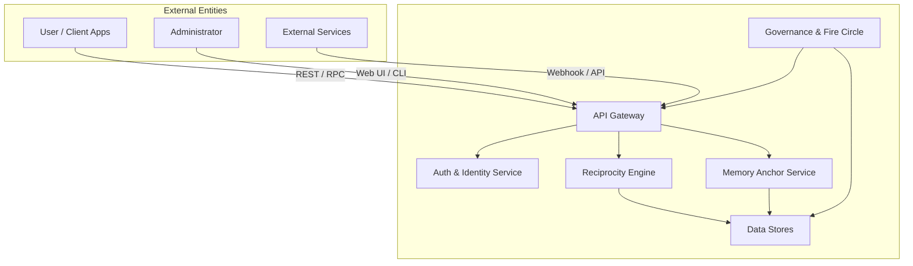
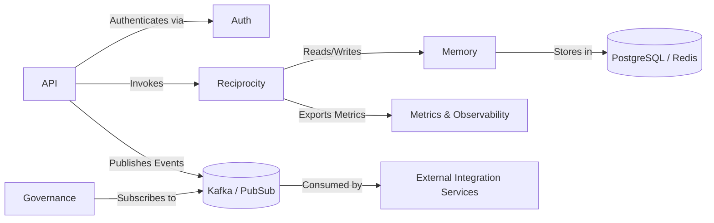

---
# System Context & Component Diagrams

Below are the high-level System Context and Component diagrams for Mallku.

*Figures: System Context (top), Component interactions (bottom).*
---

*Maintained by Mallku Architect. Adjust diagrams in tandem with ADRs and architecture updates.*
---
